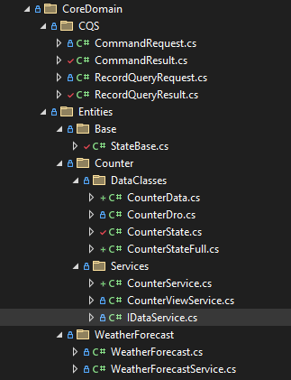
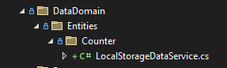
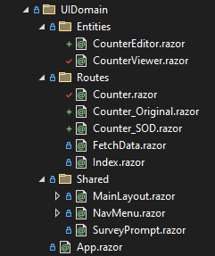

In any application it's all too easy to fall into the "Quick" solution trap.  What we forget is the "and Dirty" bit, which soon comes back to haunt us as we expand the functionality and scope of what we've coded.

The right way seems too complicated, so we cut corners.  Blazor is no different: many of the simple code examples do just that.  In "keeping it simple" they promote a mode of coding that doesn't stand up to the complexities of real world applications.

In this article I refactor the out-of-the-box template `Counter` page into something that appears far too complex for its purpose.  No one in their right mind would code it this way!  However, in the context of this article, it's a great start point: a simple requirement with a minimal data set.  We can concentrate on the coding techniques, practices and patterns that are applicable in more complex scenarios in a very simple setting.
 
Here's the standard page:

```csharp
@page "/counter"
<PageTitle>Counter</PageTitle>

<h1>Counter</h1>
<p role="status">Current count: @currentCount</p>
<button class="btn btn-primary" @onclick="IncrementCount">Click me</button>

@code {
    private int currentCount = 0;

    private void IncrementCount()
        => currentCount++;
}
```

So what's wrong?  Nothing, or an awful lot: it depends on your perspective.  There's data (`private int currentCount`), the state of that data and the presentation of that data all mixed up in a single class: the `Counter` component.  There's no "separation of concerns": it breaks a lot of SOLID coding principles.

## Repo

The repo for this article is [here - Blazr.SeparationOfConcerns](https://github.com/ShaunCurtis/Blazr.SeparationOfConcerns).

## Separate Out the Data

We can separate the data by building a Counter class.

```csharp
public class CounterData
{
    public int Counter { get; set; }
}
```

A view service:

```csharp
public class CounterService
{
    public CounterData Data { get; private set; } = new();

    public void Increment()
        => Data.Counter++;
}
```

Registered in `Program`:

```csharp
builder.Services.AddScoped<CounterService>();
```

And the Counter route component: 

```cssharp
@page "/counter"
@inject CounterService Service

<PageTitle>Counter</PageTitle>

<h1>Counter</h1>

<p role="status">Current count: @Service.Data.Counter</p>

<button class="btn btn-primary" @onclick="IncrementCount">Click me</button>

@code {
    private void IncrementCount()
        => Service.Increment();
}
```


## State

So far so good, but we haven't solved the state problem.  How do we know when a value has changed?  Is our object dirty - different from the original - or clean - the same as the original.

First we define a record that represents our data (Dro = Data Record Object):

```csharp
public record CounterDro(
    int Counter
    );
```

It's immutable, no one can change it.  And we can compare two `CounterDro` objects where `Counter` is `2` and the comparator will return true.

The counter has only one property, and it always increments, so its easy to track the changes.  That isn't normally the case.  Data objects have multiple properties that can change to new values or revert to original values.

There are frameworks for managing state - Fluxor works well with Blazor.  This article demonstrates a relatively simple methodology which loosely implements the *Observer* pattern.

### CounterState

`CounterState` replaces `CounterData`.

```csharp
public class CounterState
```
A property and private field for each editable property.

```csharp
    private int _counter;
    public int Counter
    {
        get => _counter;
        set => SetAndNotifyIfChanged(ref _counter, value, "Counter");
    }
```

A field to hold the record provided in the Ctor new method and a method to load the data from the provided record.  The actual loading code is separated out as we use it in other methods.

```csharp
    private CounterDro BaseRecord = default!;

    public CounterState1(CounterDro record)
        => this.Load(record);

    public void Load(CounterDro record)
    {
        // save a copy of the provided record, not the original
        this.BaseRecord = record with { };
        Counter = record.Counter;
        this.NotifyStateMayHaveChanged();
    }
```

A method to build a record based on the current property values:

```csharp
    public CounterDro AsRecord() => new(
        Counter: this.Counter
        );
```

A Property to get the edit state using record equality checking.

```csharp
    public bool IsDirty
        => BaseRecord?.Equals(AsRecord())
            ?? this.AsRecord() is not null;
```

Two events and notification methods for field and state change:

```csharp
    public event EventHandler<string>? FieldChanged;
    public event EventHandler<bool>? StateChanged;

    protected void NotifyFieldChanged(string fieldName)
        => FieldChanged?.Invoke(this, fieldName);

    protected void NotifyStateMayHaveChanged()
        =>  this.StateChanged?.Invoke(this, this.IsDirty);
```

A method to detect property change and notify as required:

```csharp
    protected void SetAndNotifyIfChanged<TType>(ref TType? currentValue, TType? value, string fieldName)
    {
        if (!currentValue?.Equals(value) ?? value is not null)
        {
            currentValue = value;
            this.NotifyFieldChanged(fieldName);
            this.NotifyStateMayHaveChanged();
        }
    }
```

A method to reset the context to the original data:

```csharp
    public void Reset()
        => this.Load(BaseRecord);
```
A method to set the context to the current state used when the state is saved:

```csharp
    public void Update()
        => this.Load(AsRecord());
```

##### Null Coalescing and Conditional Operators

The code above uses *Null Coalescing* and *Null Conditional* operators.  For those not fully conversant with the modern Null operators, the later versions of C# offer more concise language for dealing with null.  You no longer need to write `if (x == null) ....` very often. 

```
!currentValue?.Equals(value)
```

checks if the two values are not equal.  

However, `currentValue` could be null and throw an exception.  The `?` - the *Null conditional operator* - returns `null` if the object tested is null.  Everything to the right of the operator - `.Equals(value)` - is not evaluated.

That's solves the initial exception, but we are doing a boolean check and a return value of null with also throw an error.  We solve this by applying the *Null Coalescing* operator `??`.

```
?? value is not null
```

This returns the right side of the statement (after `??`) if the left side evaluates to null.

In our case `currentValue` is null - we wouldn't be doing the evaluation if it wasn't - so if value is not null, it has changed and we return the result - `true`.

You'll see this null checking language used throughout the code.


### Abstracting Common Functionality into StateBase

The above code provides a pattern that can be re-used.  We can abstract out most of the functionality into an abstract `StateBase` class.

```csharp
public abstract class StateBase<TRecord>
{
    protected TRecord BaseRecord = default!;

    public event EventHandler<string>? FieldChanged;
    public event EventHandler<bool>? StateChanged;

    public StateBase(TRecord record)
        => this.Load(record);

    public abstract TRecord AsRecord();
    public abstract void Reset();
    public abstract void Update();
    public abstract void Load(TRecord record);

    public bool IsDirty 
        => BaseRecord?.Equals(AsRecord()) 
            ?? this.AsRecord() is not null;

    protected void SetAndNotifyIfChanged<TType>(ref TType? currentValue, TType? value, string fieldName)
    {
        if (!currentValue?.Equals(value) ?? value is not null)
        {
            currentValue = value;
            this.NotifyFieldChanged(fieldName);
            this.NotifyStateMayHaveChanged();
        }
    }

    protected void NotifyFieldChanged(string fieldName)
        => FieldChanged?.Invoke(this, fieldName);

    protected void NotifyStateMayHaveChanged()
        =>  this.StateChanged?.Invoke(this, this.IsDirty);
}
```

Our new CounterState class now looks like this:

```csharp
public class CounterState : StateBase<CounterDro>
{
    private int _counter;
    public int Counter
    {
        get => _counter;
        set => SetAndNotifyIfChanged(ref _counter, value, "Counter");
    }

    public CounterState(CounterDro record)
        : base(record) { }

    public override void Load(CounterDro record)
    {
        this.BaseRecord = record with { };
        Counter = record.Counter;
        this.NotifyStateMayHaveChanged();
    }

    public override CounterDro AsRecord() => new(Counter: this.Counter);

    public override void Reset()
        => this.Load(BaseRecord);

    public override void Update()
        => this.Load(AsRecord());
}
```

## Services

At this point we need to update our services.

`CounterViewService` is our new view service.  It provides two methods to get and save the counter data to/from an undefined store.

```csharp
public class CounterViewService
{
    public readonly CounterState StateContext = new CounterState(new CounterDro(0));

    private readonly IDataService _counterDataService;

    public CounterViewService(IDataService counterDataService)
        => _counterDataService = counterDataService;

    public async Task GetCounterAsync()
    {
        var result = await _counterDataService.ReadAsync<CounterDro>(new RecordQueryRequest<CounterDro>("Counter"));
        this.StateContext.Load(result.Record ?? new CounterDro(0));
    }

    public async Task SaveCounterAsync()
    {
        var request = new CommandRequest<CounterDro>(
            StorageName: "Counter", 
            Record: this.StateContext.AsRecord());

        var result = await _counterDataService.SaveAsync<CounterDro>(request);

        if (result.Successful)
            this.StateContext.Update();
    }

    public async Task Increment()
    {
        StateContext.Counter++;
        await SaveCounterAsync();
    }
}
```

The `IDataService` is defined as follows.  We'll look at the actual implementation shortly.

```Csharp
public interface IDataService
{
    public ValueTask<CommandResult> SaveAsync<TRecord>(CommandRequest<TRecord> request);
    public ValueTask<RecordQueryResult<TRecord>> ReadAsync<TRecord>(RecordQueryRequest<TRecord> request);
}
```

The class demonstrates some important concepts.

**Abstraction** 

We separate the data persistance out though an interface.  `CounterViewService` injects the `IDataService` defined in the service container.  It doesn't care if the implementation loaded is session base storage, `LocalStorage`, a SQL database or a remote store.

**Command/Query Separation**

Operatons are either:

1. *Commands* - that change state.  A *CommandRequest* object defines what needs changing and a *CommandResult* object returns status information  - normally Success/Failure and a message.

2. *Queries* - request data: they don't change it.  A *QueryRequest* defines the data to get and a *QueryResult* contains the requested data and status information - normally Success/Failure and a message.
    
Request and result objects are defined as immutable records. 


### Data Persistance

The application presists data to Browser Local Storage.

Here's the `IDataService` implementation that uses the `ProtectedLocalStorage` package.  The code is self explanatory.

```csharp
public class LocalStorageDataService : IDataService
{
    private readonly ProtectedLocalStorage _storage;

    public LocalStorageDataService(ProtectedLocalStorage storage)
        => _storage = storage;

    public async ValueTask<CommandResult> SaveAsync<TRecord>(CommandRequest<TRecord> request)
    {
        if (request.Record is not null)
            await _storage.SetAsync(request.StorageName, request.Record);

        // No return so we return success!
        return CommandResult.Success();
    }

    public async ValueTask<RecordQueryResult<TRecord>> ReadAsync<TRecord>(RecordQueryRequest<TRecord> request)
    {
        // We need to cover the situation were the component calling this is in the initial page
        // and Blazor server is trying to statically render the page
        try
        {
            var result = await _storage.GetAsync<TRecord>(request.StorageName);
            return new RecordQueryResult<TRecord> { Successful = result.Success, Record = result.Value, Message = $"Failed to retrieve a value for {request.StorageName}" };
        }
        catch
        {
            return new RecordQueryResult<TRecord> { Successful = false, Message = $"Failed to retrieve a value for {request.StorageName}" };
        }
    }
}
```

## Service Registration

The new services are registered in `Program`:

```
builder.Services.AddScoped<CounterViewService>();
builder.Services.AddScoped<IDataService, LocalStorageDataService>();
```


## Updating the UI

We can now update the UI components.

First a Counter Viewer component to display the counter information

```csharp
@inject CounterViewService Service
@implements IDisposable

<div class="bg-light border-dark p-3 m-3">
    <h3>Counter Viewer</h3>
    <div>Counter : @this.Service.StateContext.Counter</div>
</div>

@code {
    protected override void OnInitialized()
        => Service.StateContext.StateChanged += OnStateChanged;

    private void OnStateChanged(object? sender, bool state)
                => this.InvokeAsync(StateHasChanged);

    public void Dispose()
        => Service.StateContext.StateChanged += OnStateChanged;
}
```

An "Editor" for the increment button - we are editing the context:

```csharp
@inject CounterViewService Service

<div class="bg-light p-3 m-3">
    <h3>Counter Editor</h3>
    <button class="btn btn-primary" @onclick=this.IncrementCount>Increment Counter</button>
</div>

@code {
    private async Task IncrementCount()
        => await this.Service.Increment();
}
```

And the new Counter route:

```csharp
@page "/counter"
@inject CounterViewService Service

<PageTitle>Counter</PageTitle>

<CounterViewer />

<CounterEditor />

@code {
    protected override async Task OnInitializedAsync()
    {
        //ensures the component had initially rendered before attempt to read browser data
        await Task.Delay(1);
        await this.Service.GetCounterAsync();
    }
}
```

## Summary

This implementation demonstrates:

1. How to separate out functionality into single purpose objects.
2. How to separate data and state from the UI.
3. How to use abstraction to decouple Data from the core application code.
4. How to build a simple state persistance implementation.

## Appendix

### Project Structure








### The CQS objects

#### Command Objects

```csharp
public record CommandRequest<TRecord>(string StorageName, TRecord Record);

public record CommandResult
{
    public bool Successful { get; init; }
    public string Message { get; init; } = string.Empty;

    public static CommandResult Success()
        => new CommandResult { Successful = true };

    public static CommandResult Failure(string message)
        => new CommandResult { Successful = false };
}
```

#### Query Objects

```csharp
public record RecordQueryRequest<TRecord>(string StorageName);

public record RecordQueryResult<TRecord>
{
    public TRecord? Record { get; init; }
    public bool Successful { get; init; }
    public string Message { get; init; } = string.Empty;

    public static RecordQueryResult<TRecord> Success(TRecord record)
        => new RecordQueryResult<TRecord> { Record = record, Successful = true };

    public static RecordQueryResult<TRecord> Failure(string message)
        => new RecordQueryResult<TRecord> { Successful = false };
}
```
