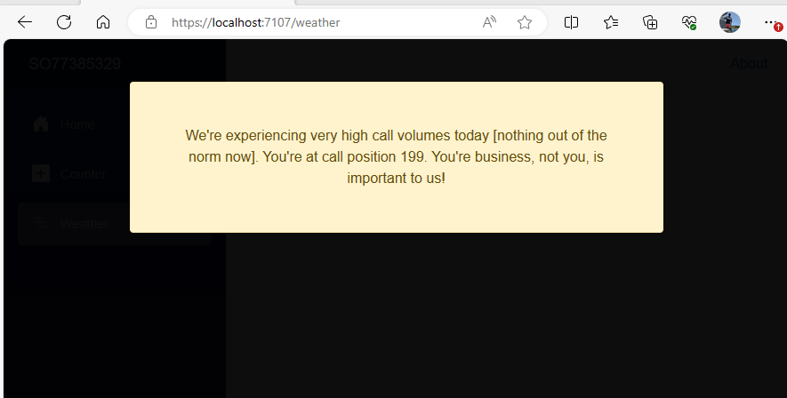


The main applicable for this component is where pages load slowly.  I'll demonstrate it use in the `FetchData` page.



## The Overlay Component

*LoadingOverlay.razor* adds a `div` to the page with a loading message.  It's state [whether it's displayed] is controlled through CSS.

```csharp
<div class="@_css">
    <div class="container text-center">
        <div class="alert alert-warning m-5 p-5">We're experiencing very high call volumes today [nothing out of the norm now]. 
            You're at call position 199.  You're business, not you, is important to us!</div>
    </div>
</div>
@if(this.ChildContent is not null)
{
    @this.ChildContent
}
@code {
    private string _css => this.IsLoading ? "loading" : "loaded";

    [Parameter] public bool IsLoading { get; set; }
    [Parameter] public RenderFragment? ChildContent { get; set; }
}
```

The associated Css file *LoadingOverlay.razor.css*.

*loading* sets the `div` to fill the page with a high `z-index`.  You can choose the opacity based on whether you want to bleed the underlying page through.  *loaded* hides the `div`. 

```css
div.loading {
    display: block;
    position: fixed;
    z-index: 101; /* Sit on top */
    left: 0;
    top: 0;
    width: 100%; /* Full width */
    height: 100%; /* Full height */
    overflow: auto; /* Enable scroll if needed */
    background-color: rgba(0,0,0,0.95); /* Black w/ opacity */
}

div.loaded {
    display: none;
}
```

You can then use it in a page such as `FetchData`:

```csharp
@page "/weather"
@attribute [StreamRendering(true)]

<PageTitle>Weather</PageTitle>
<LoadingOverlay IsLoading="_loading" />

    <h1>Weather</h1>

    <p>This component demonstrates showing data.</p>

    @if (_loading)
    {
        <p><em>Loading...</em></p>
    }
    else
    {
        <table class="table">
            <thead>
                <tr>
                    <th>Date</th>
                    <th>Temp. (C)</th>
                    <th>Temp. (F)</th>
                    <th>Summary</th>
                </tr>
            </thead>
            <tbody>
                @foreach (var forecast in forecasts!)
                {
                    <tr>
                        <td>@forecast.Date.ToShortDateString()</td>
                        <td>@forecast.TemperatureC</td>
                        <td>@forecast.TemperatureF</td>
                        <td>@forecast.Summary</td>
                    </tr>
                }
            </tbody>
        </table>
    }

@code {
    private WeatherForecast[]? forecasts;
    private bool _loading => forecasts == null;

    protected override async Task OnInitializedAsync()
    {
        // Simulate asynchronous loading to demonstrate streaming rendering
        await Task.Delay(2000);

        var startDate = DateOnly.FromDateTime(DateTime.Now);
        var summaries = new[] { "Freezing", "Bracing", "Chilly", "Cool", "Mild", "Warm", "Balmy", "Hot", "Sweltering", "Scorching" };
        forecasts = Enumerable.Range(1, 5).Select(index => new WeatherForecast
            {
                Date = startDate.AddDays(index),
                TemperatureC = Random.Shared.Next(-20, 55),
                Summary = summaries[Random.Shared.Next(summaries.Length)]
            }).ToArray();
    }

    private class WeatherForecast
    {
        public DateOnly Date { get; set; }
        public int TemperatureC { get; set; }
        public string? Summary { get; set; }
        public int TemperatureF => 32 + (int)(TemperatureC / 0.5556);
    }
}
```

You can also implement it like this:

```csharp
@page "/weather"
@attribute [StreamRendering(true)]

<PageTitle>Weather</PageTitle>
<LoadingOverlay IsLoading="_loading">

    <h1>Weather</h1>

    <p>This component demonstrates showing data.</p>

    @if (_loading)
    {
        <p><em>Loading...</em></p>
    }
    else
    {
      //....
    }
</LoadingOverlay>
```