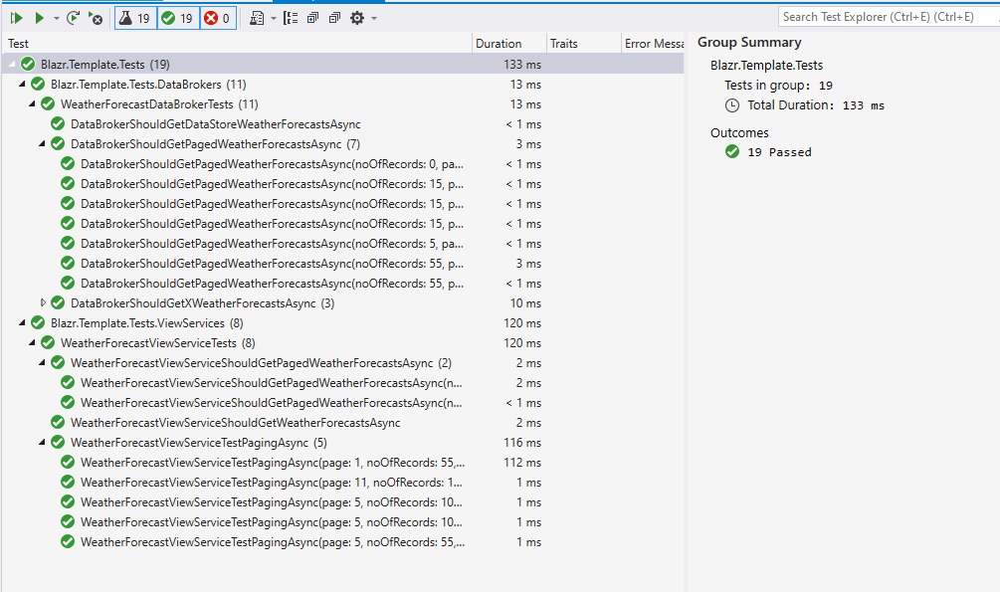

Testing is implemented in *Blazr.Template.Tests*.

This is a XUnit test project.  The project file is:

```
<Project Sdk="Microsoft.NET.Sdk">

  <PropertyGroup>
    <TargetFramework>net5.0</TargetFramework>
    <IsPackable>false</IsPackable>
  </PropertyGroup>

  <ItemGroup>
    <PackageReference Include="bunit" Version="1.3.42" />
    <PackageReference Include="FluentAssertions" Version="6.2.0" />
    <PackageReference Include="Moq" Version="4.16.1" />
    <PackageReference Include="Tynamix.ObjectFiller" Version="1.5.6" />
    <PackageReference Include="Microsoft.NET.Test.Sdk" Version="17.0.0" />
    <PackageReference Include="xunit" Version="2.4.1" />
    <PackageReference Include="xunit.runner.visualstudio" Version="2.4.3">
      <IncludeAssets>runtime; build; native; contentfiles; analyzers; buildtransitive</IncludeAssets>
      <PrivateAssets>all</PrivateAssets>
    </PackageReference>
    <PackageReference Include="coverlet.collector" Version="3.1.0">
      <IncludeAssets>runtime; build; native; contentfiles; analyzers; buildtransitive</IncludeAssets>
      <PrivateAssets>all</PrivateAssets>
    </PackageReference>
  </ItemGroup>

  <ItemGroup>
    <ProjectReference Include="..\Blazr.Template.Core\Blazr.Template.Core.csproj" />
    <ProjectReference Include="..\Blazr.Template.Data\Blazr.Template.Data.csproj" />
    <ProjectReference Include="..\Blazr.Template.UI\Blazr.Template.UI.csproj" />
  </ItemGroup>

</Project>
```

The tests demonstrate how to implement various testing strategies.



I'n not going to go into details here.  There are two test code modules:

 - WeatherForecastDataBrokerTests
 - WeatherForecastViewServiceTests

Revciew the code to see how they work.