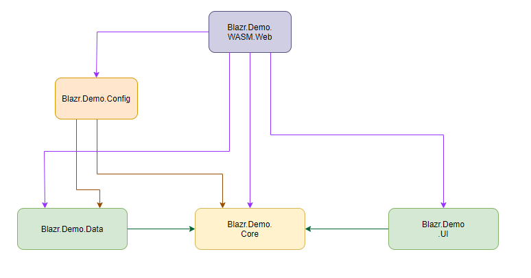

Large, well organised software projects normally apply a strict set of design principles.  Smaller teams less so.

This short article describes a basic architecture that many individuals and organisations have come to independantly.  It goes by many names, and has many variations, but the principles remain the saame.  The two names I use here are *Clean* and *Sound*. 

This article provides a short overview of the architecture - it's pretty simple - and then applies the architecture to build a new Blazor Template based on the out-of-the-box templates.

We'll use the Blazr.Demo solution to discuss the architecture implementation in practice.

The key design goals are:

1. Enforced Separation of Concerns
2. Abstraction of Dependencies

Any application can broadly be separated into three *Domains*:

1. **The Data Domain** - getting data from and too data stores, be they file systems, SQL databases or API's.
2. **The Core domain** - the core business logic of the application. What turns the raw data from the Data Domain into useful information that can be presented in the UI Domain. 
3. **The UI Domain** - displaying and handling data input.

The diagram below illustrates these domains and the dependencies.

The core principles of the architecture are:

1. The Core Domain has no dependencies on other domains within the project.  You can have your own libraries, but these should also adhere to the same design principles.
2. The Data and UI domains have a dependency on the Core Domain, but not on each other.

Application of this architecture means you can change out the UI or the data store with no impact on the Core Domain Code.

## The Template/Solution

The template and solution are available on GitHub:

 - [Blazr.Demo](https://github.com/ShaunCurtis/Blazr.Demo)
 - [Blazor.Demo.Template](https://github.com/ShaunCurtis/Blazr.Demo.Template)

The solution splits the application codebase into three main code domains:

1. **Data Domain** - all code relating to data management.
2. **Core domain** - this is the core application code the business and logical layers of an application.  It has no dependancies on other solution projects.
3. **UI Domain** - this contains all the UI component code.

And two support **Domains**:

1. **Controller Domain** - the API controller code.  This is strictly not Blazor Code.  It's standard server side DotNetCore.
2. **Config Domain** - contains configuration data for the solution and the Web projects.

### Solution Projects

Within the project this translates into the following projects:

1. **.Core** - *Microsoft.NET.Sdk* SDK - Contains all the Core Domain code.  No internal project dependencies.
2. **.Data** - *Microsoft.NET.Sdk* SDK - Contains all the Data Domain code.  Only dependency is on *.Core*.
3. **.UI** - *Microsoft.NET.Sdk.Razor* SDK - contains all the UI component code.  Only Dependency is on *.Core*.
4. **.Config** - *Microsoft.NET.Sdk.Razor* SDK - contains the application configuration code and the `IServiceCollection` extension methods.   Dependencies are *.Core* and *.Data*.
5. **.Controller** - *Microsoft.NET.Sdk* SDK - contains the API controllers. Normal Dependency is *.Core*.  Should interface with the data domain through the same interfaces as used by the core.
6. **.Server.Web** - *Microsoft.NET.Sdk.Web* SDK - The Web Server project to run the Server SPA.
7. **.WASM** - *Microsoft.NET.Sdk.BlazorWebAssembly* SDK - the project to build and bundle the WASM codebase.
8. **.WASM.Web** - *Microsoft.NET.Sdk.Web* SDK - The Web Server project to host the WASM SPA and run the WASM API Controllers.
9. **.Tests** - *Microsoft.NET.Sdk* SDK - The XUnit/BUnit test project.

## Project Dependencies

### Server SPA/Web Dependencies

### WASM SPA/Web Dependencies

## Key Design Points:

1. The core application code is separated from the Data Source and UI.  The UI or the Data Source can be changed out without impacting on the application code.
2. The core to data domain interface is through `interfaces`.  This design uses Data Brokers as *thin* pass through layers to implement the interfaces.
3. Using projects for each domain allows good dependency control.  Namespaces within a project are too easy to breach and more difficult to control and detect.
4. All the Blazor specific code is shared.  It's the same for the WASM and Server SPAs.  The only differences in this solution are the service configurations for the Data Brokers.

## Running the SPA's

To run the SPA's set the following as the solution startup project:

1. **Server SPA** - **.Server.Web*
2. **WASM SPA** - **.WASM.Web*

## Using the Template

You can install the template in Visual Studio by copying *Blazr.Demo.zip* to your *Project Templates* folder - normally in *Documents/Visual Studio 2022/Templates/Project Templates*.
