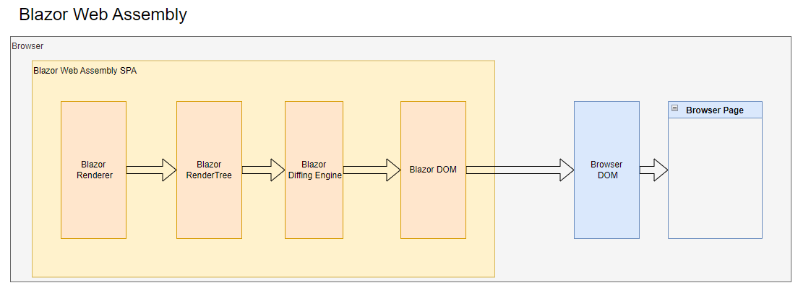

This article will attempt to answer the following questions:

1. Want is a component?
2. How do components work?
3. How do I use components?

## What is a Component?

Microsoft defines:

*A component is a self-contained portion of user interface (UI) with processing logic to enable dynamic behavior. Components can be nested, reused, shared among projects, and used in MVC and Razor Pages apps.*

*Components are implemented using a combination of C# and HTML markup in Razor component files with the .razor file extension.*

More what is does rather than what it is.  And not all strictly true.

From a programming perspective, a component is simply: 

*A class that implements `IComponent`.*

That's it.

Here's as simple implementation as you can create.

1. It fulfills the minimum requirements.
2. It will compile and work.  

Try it. You won't see anything because it has no visible html output.

```csharp
public class TotallyMinimal : IComponent
{
    public void Attach(RenderHandle handle)
    { }

    public Task SetParametersAsync(ParameterView parameters)
        =>  Task.CompletedTask;
}
```

To get output, add a line of code to `Attach`.

```csharp
public class Minimal : IComponent
{
    public void Attach(RenderHandle handle)
        =>  handle.Render( (builder) => builder.AddMarkupContent(0, "<h1>Hello from Minimal</h1>") );

    public Task SetParametersAsync(ParameterView parameters)
        => Task.CompletedTask;
}
```

Not very useful, but it demonstrates core component functionality.

## The Blazor UI

Blazor Server or Blazor WASM?  Regard them as two modes of deployment, not two different development paths.

Design your components to be deployment agnostic: they should run in either mode.

This section provides a quick look at the differences between the two and how those differences affect UI development. 

### Blazor Server

Blazor Server defines the `<app>` component in the initial server/html page.  It looks like this:

```html
<app>
    <component type="typeof(App)" render-mode="ServerPrerendered" />
</app>
```
`type` defines the root component class - in this case `App` and `render-mode` defines how the initial server-side render process runs.  You can read about that elsewhere.  The only important point to understand is: if it pre-renders, the load page will be rendered twice on initial load - once by the server to build a static version of the page, and then a second time by Hub Session when it builds the live page for the browser client code.  This only occurs for the intial load page: every page therafter is loaded once.

The browser client code gets loaded by:

```html
<script src="_framework/blazor.server.js"></script>
```

This is not the WASM code.  It's JS code to interact with the browser DOM and Hub session over SignalR.

Once *blazor.server.js* loads, the Blazor client JS application runs in the browser page and establishes a SignalR session with the server.  To complete the initial load, the Blazor Client Application calls the Blazor Hub Session and requests a complete server render of the root component.  It applies the resultant DOM changes to the browser DOM.

The diagram below shows how a render request is passed to the displayed page.


### Blazor Web Assembly

In Blazor Web Assembly the browser receives an Html page with a defined `div` placeholder where the root component should load: 

```html
<div id="app">
    ....
</div>
```

The Client Application is loaded when this script is run:

```html
<script src="_framework/blazor.webassembly.js"></script>
```

Once the WASM code is loaded, it runs `program`.

```csharp
builder.RootComponents.Add<App>("#app");
```

The code tells the Renderer that the `App` class component is the root component for the `RenderTree` and to load it's DOM into the `app` element in the browser DOM.



Although the process by which the root component is defined and loaded is different, there's no difference between a WebAssembly and Server root component or any sub-component.  They are the same components. 

### App.razor
 
*App.razor* is the "standard" root component.  It can be any `IComponent` defined class.

`App` looks like this:

```html
<Router AppAssembly="@typeof(Program).Assembly">
    <Found Context="routeData">
        <RouteView RouteData="@routeData" DefaultLayout="@typeof(MainLayout)" />
    </Found>
    <NotFound>
        <LayoutView Layout="@typeof(MainLayout)">
            <p>Sorry, there's nothing at this address.</p>
        </LayoutView>
    </NotFound>
</Router>
```

It's a Razor component defining one child component, `Router`.  `Router` has two `RenderFragments`, `Found` and `NotFound`.  

#### Found

If `Router` finds a route, and therefore an `IComponent` class, it renders the `RouteView` component passing it the route class type along with the default `Layout` class.   

`RouteView` checks if the `RouteData` component has a specific layout class defined.  If so it uses it, otherwise it uses the default layout.  It renders the layout and passes it the type of the component to add to the `Body` RenderFragment.  

#### Not Found

If no route is found it renders the content of `NotFound`, a `LayoutView` with some content.

### Routed Components

Everything's a component, but not all components are equal.  

Routed Components contain *@page* routing directives and optionally a *@Layout* directive.

When the `Route` component initializes, it builds it's routing table by searching the loaded assembly for all `IComponent` implementating class and a `@page` directive.

Page and Layout directives are declared like this in Razor:
```html
@page "/WeatherForecast"
@page "/WeatherForecasts"
@layout MainLayout
```

Or directly on classes like this:

```csharp
[LayoutAttribute(typeof(MainLayout))]
[RouteAttribute("/helloworld")]
public class RendererComponent : IComponent {}
```

It's a serious misconception to think routed components are web pages. if you do you will:

 - try and code the component logic as if it is a web page.
 - get confused when routed components don't behave like a page.


Many web page properties and concepts don't apply to routed components.  
