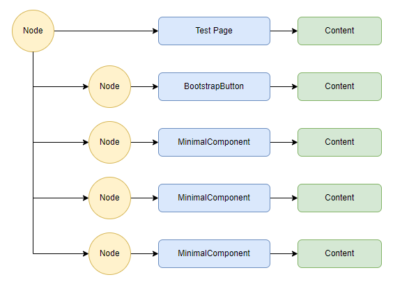

## The Component Lifecycle

The component lifecycle is managed by the Renderer.  You have no control over it.  You can't instantiate a component and pass it to the renderer, and you should never attempt to dispose a component.

1. The component is instantiated and the ctor is run.  This is often overlooked in components.  Once run, the parameters are in their default state and there's no `RenderHandle`.

2. The Renderer calls `Attach` and passes in a `RenderHandle`.  This is the component's communications channel with the Renderer.  Save it to an internal field.

3. The Renderer calls `SetParametersAsync` and passes in a `ParameterView` object.  This is the object the Renderer uses to manage the component's parameters.  This should be used in `SetParametersAsync` and released: don't save it to an internal field.

4. The Renderer calls `SetParametersAsync` whenever the parent component renders and it detects the components parameters "may have changed".

5. At completion, if the component implements `IDisposable` or `IAsyncDisposable`, it calls it and then de-references the component.  The GC will then destroy the redundant object.

## The Render Process

Let's look in detail at how a simple page and component get rendered.

The following Debug version of `MinimalBase` is used to log activity to the output.

It:
1. Logs the Ctor event.
2. Logs when `SetParametersAsync` is called
3. Logs when the Component `RenderFragment` is run by the Renderer.
4. Implements `IDisposable` and logs when `Dispose` is run.

```csharp
public abstract class MinimalDebugBase : IComponent, IDisposable
{
    protected RenderHandle renderHandle;
    private bool _renderPending;
    private RenderFragment _componentFragment;
    private Guid Uid = Guid.NewGuid();
    private string ClassName => this.GetType().Name;
    protected virtual bool hide { get; set; }

    public MinimalDebugBase()
    {
        Debug.WriteLine($"{ClassName} - instance : {Uid.ToString()} Ctor at {DateTime.Now.ToLongTimeString()}");
        _componentFragment = (builder) =>
        {
            _renderPending = false;
            if (!this.hide)
            {
                Debug.WriteLine($"{ClassName} - instance : {Uid.ToString()} rendered at {DateTime.Now.ToLongTimeString()}");
                BuildRenderTree(builder);
            }
        };
    }

    public void Attach(RenderHandle handle)
        => renderHandle = handle;

    public Task SetParametersAsync(ParameterView parameters)
    {
        parameters.SetParameterProperties(this);
        Debug.WriteLine($"{ClassName} - instance : {Uid.ToString()} parameters set at {DateTime.Now.ToLongTimeString()}");
        this.RequestRender();
        return Task.CompletedTask;
    }

    protected abstract void BuildRenderTree(RenderTreeBuilder builder);

    protected void RequestRender()
    {
        if (!_renderPending)
        {
            _renderPending = true;
            this.renderHandle.Render(_componentFragment);
        }
    }

    public void Dispose()
    {
        Debug.WriteLine($"{ClassName} - instance : {Uid.ToString()} disposed at {DateTime.Now.ToLongTimeString()}");
    }
}
```

**MinimalComponent.razor**
```csharp
@inherits MinimalDebugBase

<div class="@CssClass">
    <h3>MinimalComponent</h3>
    <h4>Rendered at @(DateTime.Now.ToLongTimeString())</h4>
    <h5>@(Uid.ToString())</h5>
</div>

@code {
    [Parameter] public bool Hidden { get; set; }
    [Parameter] public string CssClass { get; set; } = string.Empty;
    private Guid Uid = Guid.NewGuid();
    protected override bool hide => this.Hidden;
}
```

And a page that demonstrates various ways of showing and hiding components.

```csharp
@page "/MinimalDebugTest"
@inherits MinimalDebugBase

<BootstrapButton Colour="btn-primary" Text="@this.buttonText" Clicked=this.Clicked />

@if (!hidden)
{
    <MinimalComponent CssClass="bg-danger text-white p-2 m-2" />
}

<MinimalComponent Hidden=this.hidden CssClass="bg-success text-white p-2 m-2" />

<MinimalComponent CssClass="@($"bg-dark text-white p-2 m-2 {this.css}")" />

<style>
    .blazr-hide { display: none; }
    .blazr-show { display: block; }
</style>

@code {
    private bool hidden;

    private string css => hidden
        ? "blazr-hide"
        : "blazr-show";

    private string buttonText => hidden
        ? "Show"
        : "Hide";

    private void Clicked()
    {
        this.hidden = !this.hidden;
        this.RequestRender();
    }
}
```

The following log shows the sequences of events.

The route is created and renders

```text
Test - instance : a68d5db7-90a1-4b35-9811-b5f18841c406 Ctor at 22:44:19
Test - instance : a68d5db7-90a1-4b35-9811-b5f18841c406 parameters set at 22:44:19
Test - instance : a68d5db7-90a1-4b35-9811-b5f18841c406 rendered at 22:44:19
```

The Route `RenderFragment` contains the three components which are all created and parameters set.

```text
MinimalComponent - instance : e19313df-a698-456d-ab97-2407ea138cc1 Ctor at 22:44:19
MinimalComponent - instance : e19313df-a698-456d-ab97-2407ea138cc1 parameters set at 22:44:19
MinimalComponent - instance : a868fc33-5475-430c-a7a8-c378de36c4d0 Ctor at 22:44:19
MinimalComponent - instance : a868fc33-5475-430c-a7a8-c378de36c4d0 parameters set at 22:44:19
MinimalComponent - instance : 5027d65d-fc85-45cb-894e-35c4650d9505 Ctor at 22:44:19
MinimalComponent - instance : 5027d65d-fc85-45cb-894e-35c4650d9505 parameters set at 22:44:19
```

Finally the three component `RenderFragments` are run by the Renderer.  

```text
MinimalComponent - instance : e19313df-a698-456d-ab97-2407ea138cc1 rendered at 22:44:19
MinimalComponent - instance : a868fc33-5475-430c-a7a8-c378de36c4d0 rendered at 22:44:19
MinimalComponent - instance : 5027d65d-fc85-45cb-894e-35c4650d9505 rendered at 22:44:19
```
Button Clicked to Hide Components

```text
Test - instance : a68d5db7-90a1-4b35-9811-b5f18841c406 rendered at 22:44:35
MinimalComponent - instance : a868fc33-5475-430c-a7a8-c378de36c4d0 parameters set at 22:44:35
MinimalComponent - instance : 5027d65d-fc85-45cb-894e-35c4650d9505 parameters set at 22:44:35
MinimalComponent - instance : e19313df-a698-456d-ab97-2407ea138cc1 disposed at 22:44:35
MinimalComponent - instance : 5027d65d-fc85-45cb-894e-35c4650d9505 rendered at 22:44:35
```

Button clicked to Show Components

```text
Test - instance : a68d5db7-90a1-4b35-9811-b5f18841c406 rendered at 22:44:41
MinimalComponent - instance : e29082ac-70e8-4e73-835c-a05456e96c6c Ctor at 22:44:41
MinimalComponent - instance : e29082ac-70e8-4e73-835c-a05456e96c6c parameters set at 22:44:41
MinimalComponent - instance : a868fc33-5475-430c-a7a8-c378de36c4d0 parameters set at 22:44:41
MinimalComponent - instance : 5027d65d-fc85-45cb-894e-35c4650d9505 parameters set at 22:44:41
MinimalComponent - instance : e29082ac-70e8-4e73-835c-a05456e96c6c rendered at 22:44:41
MinimalComponent - instance : a868fc33-5475-430c-a7a8-c378de36c4d0 rendered at 22:44:41
MinimalComponent - instance : 5027d65d-fc85-45cb-894e-35c4650d9505 rendered at 22:44:41
```

Button clicked to leave the page

```text
Test - instance : a68d5db7-90a1-4b35-9811-b5f18841c406 disposed at 22:44:51
MinimalComponent - instance : e29082ac-70e8-4e73-835c-a05456e96c6c disposed at 22:44:51
MinimalComponent - instance : a868fc33-5475-430c-a7a8-c378de36c4d0 disposed at 22:44:51
MinimalComponent - instance : 5027d65d-fc85-45cb-894e-35c4650d9505 disposed at 22:44:51
```

The diagram for Show looks like this:



And for Hide:


The key differences between the three methods are:

1. The `@if...` logic in the main component builds and destroys a new component when the state changes.  If you had a component subtree here it would be built or destroyed every time the logiv changes.  It's an expensive operation.

2. The `Hide` logic built into the component doesn't modify the component tree.  It just affects the UI output from the component.   As the component render logic is never run when *Hidden*, any null references aren't hit such as displaying a list that is null.    

3. The Css change only affects what's displayed.  The component still outputs the content, it's the browser DOM that hides it.  If the component render logic hits null references and doesn't have code to deal with them, it will generate an application error.